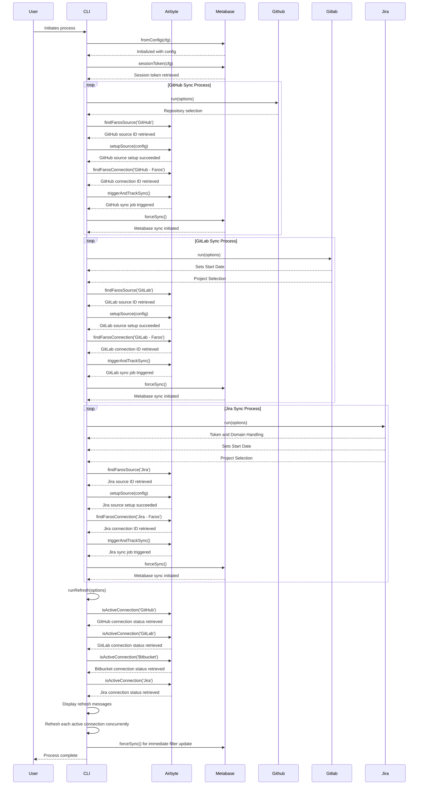

### CLI

ENTRYPOINT ["/home/node/cli/bin/main"]:

This line sets the entry point for the Docker container. When the container starts, it will execute the main script located in the /home/node/cli/bin directory.

#### Metabase

- **run**
  - **Initializes** with an Axios instance (`api`) that is used to make HTTP requests to the Metabase API.
  - **fromConfig Method**:
    - **Static Method**: Creates a new instance of Metabase based on the provided configuration (`cfg`).
    - **Steps**: Retrieves a session token using the `sessionToken` method.
    - **Configures** an Axios instance (`api`) with the retrieved session token for subsequent API requests.
    - **Returns** a new Metabase instance initialized with the Axios instance.
  - **sessionToken Method**:
    - **Parameters**: Accepts `cfg` object containing Metabase configuration (url, username, password).
    - **Returns**: A promise resolving to the session token (`data.id`) if successful.
    - **Error Handling**: Uses `wrapApiError` to handle and wrap any errors encountered during the API call.
  - **forceSync Method**
    - **Sends** a POST request to the Metabase API endpoint (`database/2/sync_schema`).
    - **Returns** the response data upon success.
    - **Error Handling**: Uses `wrapApiError` to handle errors encountered during the API call.

#### Github

- **run**
  - **Repository Selection**: Fetches and prompts the user to select repositories if not provided.
  - **Airbyte Setup**: Configures an Airbyte source with the selected repositories and credentials.
  - **Sync Trigger**: Initiates and tracks the data sync process with Airbyte.
  - **Metabase Sync**: Forces a sync in Metabase to ensure filters are populated immediately.

#### Gitlab

- **run**
  - **Sets Start Date**: Calculates the start date based on the cutoff days.
  - **Project Selection**: Fetches and prompts the user to select projects if not provided.
    - Handles cases where no projects are found or selected.
  - **Airbyte Setup**: Configures an Airbyte source with the selected projects and credentials.
  - **Sync Trigger**: Initiates and tracks the data sync process with Airbyte.
  - **Metabase Sync**: Forces a sync in Metabase to ensure filters are populated immediately.

#### Jira

- **run**
  - **Token and Domain Handling**: Prompts the user for Jira domain, email, and token if not provided.
  - **Sets Start Date**: Calculates the start date based on the cutoff days.
  - **Project Selection**: Fetches and prompts the user to select projects if not provided.
    - Handles cases where no projects are found or selected.
  - **Airbyte Setup**: Configures an Airbyte source with the selected projects and credentials.
  - **Sync Trigger**: Initiates and tracks the data sync process with Airbyte.
  - **Metabase Sync**: Forces a sync in Metabase to ensure filters are populated immediately.

#### Refresh

- **run.ts**
  - Defines functionality for refreshing various data sources managed by the Airbyte client.
  - **runRefresh Function**
    - **Purpose**: Handles the logic for refreshing various data sources.
    - **Steps**:
      - Initializes an empty array `work` to store asynchronous tasks.
      - Checks the status of each data source (GitHub, GitLab, Bitbucket, Jira) using `isActiveConnection` method.
      - If a data source is active:
        - Displays a refresh message using emojis.
        - Pushes a refresh task (`cfg.airbyte.refresh`) into the `work` array.
      - If no data sources need refreshing (`work` array is empty), displays a message indicating "nothing to refresh".
      - If there are tasks in the `work` array, waits for all tasks to complete using `Promise.all`.
    - Leverages promises and asynchronous operations (`Promise.all`) to handle refreshing each data source concurrently when applicable.

