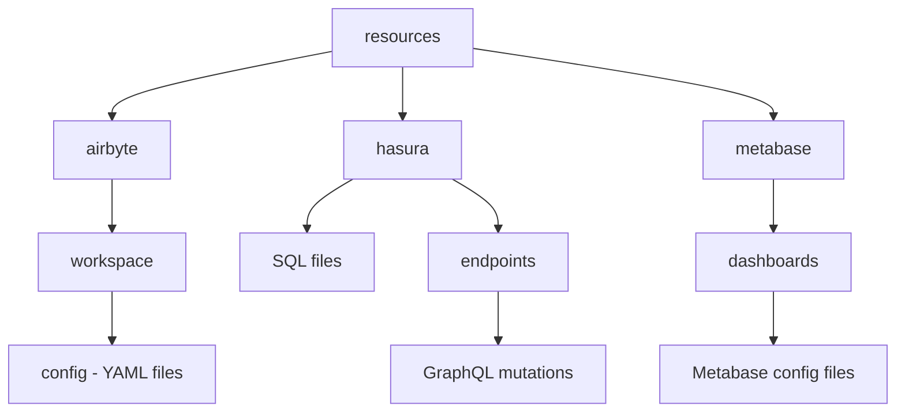
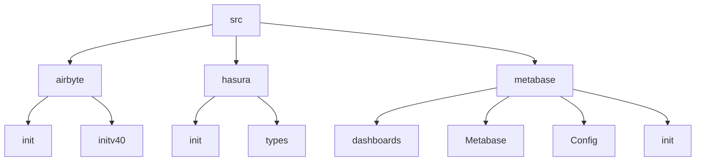
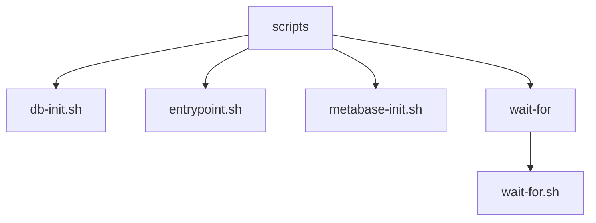

# /Init/

### resources/

- **`airbyte`**
  - **`workspace`**
    - **config**: Contains config YAML files needed for Airbyte connection.
- **`hasura`**
  - Contains SQL files for listing tables.
  - **`endpoints`**
    - This folder contains GraphQL mutation files doing various operations such as inserting and updating artifacts, builds, and deployments.
- **`metabase`**
  - **`dashboards`**
    - Contains Metabase configuration files for Metabase dashboards.

### src/

- **`airbyte/`**

  - **`init.ts`**: Handles initialization and setup for Airbyte integrations, including telemetry, workspace management, health checks, Docker image handling, and CLI integration.
  - **`initv40.ts`**: Manages workspace configuration within Airbyte, including creation of custom definitions, integration management based on YAML configurations, and version handling for Docker images.

- **`hasura/`**

  - **`init.ts`**: Integrates with Hasura to automate schema tracking, relationship creation, and endpoint management using Axios for API interactions and pino for logging. Key functionalities include:

    - Tracking all database tables and foreign key relationships.
    - Managing metadata including query collections and REST endpoints.
    - Creating object and array relationships based on foreign keys.
    - Loading query collections from GraphQL files and updating Hasura endpoints accordingly.

  - **`types.ts`**: Defines TypeScript types and interfaces specific to Hasura operations and configurations, ensuring type safety and consistency throughout the project.

- **`metabase/`**
  - **`config.ts`**: Contains configurations for Metabase integration, including setup parameters, authentication details, and API endpoints.
  - **`init.ts`**: Initializes Metabase configurations, handles API interactions, and manages initializations necessary for interacting with Metabase services.
  - **`metabase.ts`**: Main Metabase class handling interactions with the Metabase API.
  - **`dashboard.ts`**: Class Dashboards for managing Metabase dashboards, including export/import functionality.

## src/scripts

1. **`db-init.sh`**:

   - Initializes databases (Faros, Hasura, Metabase, N8N) if they do not exist.
   - Applies flyway migrations to database.

2. **`entrypoint.sh`**:

   - Orchestrates the startup and initialization sequence of services (`DB`, `Airbyte`, `Hasura`, `Metabase`).
     - Waits for services to become available using `wait-for.sh`.
     - Initializes each service sequentially, handling dependencies and optional configurations.
     - Displays a banner upon successful initialization.

3. **`metabase-init.sh`**:

   - Configures Metabase by interacting with its API, setting up databases and initializing configurations.

4. **`wait-for/`**:
   - Provides a utility to wait for a specified host (or URL) and port to become available before continuing execution.

### src/lib

- **`airbyte/`** - contains the compiled output of `src`

- **`hasura/`** - contains the compiled output of `src`

- **`metabase/`** - contains the compiled output of `src`
