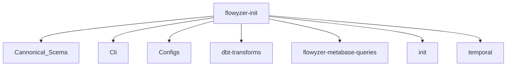
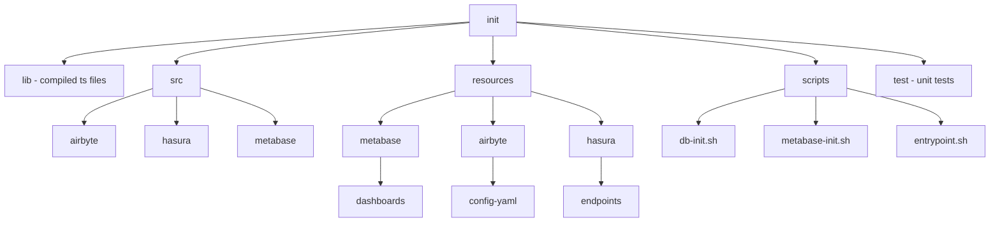
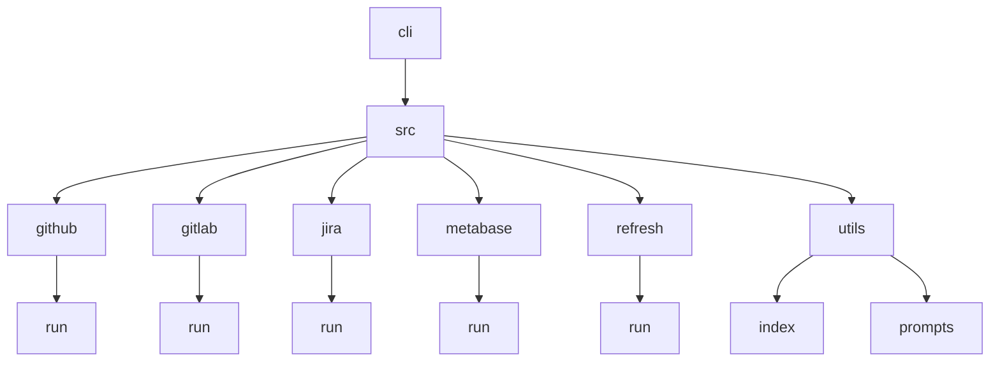
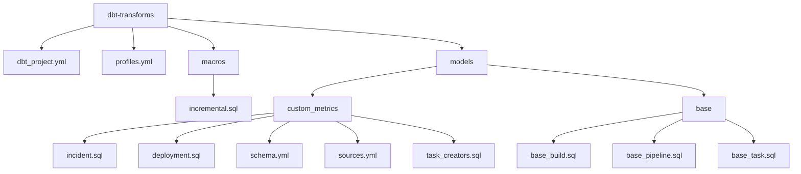

# File & Folder Structure

- flowyzer-init
  - Cannonical_Scema
  - Cli
  - Configs
  - dbt-transforms
  - flowyzer-metabase-queries
  - init
  - temporal

[How Flowyzer Starts](./starting_flow.md)

## /init/
[Overview of init](./init/overview.md)

- **init**
  - **lib**
    - Contains all the compiled output files of the `src` folder's files.
  - **src**
    - **airbyte**
      - Contains all the initialization and setup of the Airbyte workspace.
    - **hasura**
      - Set up and manage the Hasura GraphQL engine by interacting with the Hasura API.
    - **metabase**
      - `metabase.ts`: Handles authentication and API interactions with Metabase, including dashboard operations.
      - `dashboards.ts`: Implements operations for managing Metabase dashboards, integrated with `metabase.ts` for API interactions and logging.
      - `init.ts`: Gets triggered by `entrypoint.sh` with relevant commands.
  - **resources**
    - **metabase**
      - `dashboards`: Contains all config files for Metabase dashboards.
    - **hasura**
      - Contains the Hasura GraphQL queries and SQL queries.
    - **airbyte**
      - Contains connection config YAML files.
  - **scripts**
    - Contains all the shell scripts (`entrypoint.sh`, `db-init.sh`, `metabase-init.sh`).
  - **test**
    - Contains unit tests.

## /cli/
[Overview of cli](./cli/flow.md)

The `cli` directory contains scripts and functionality for integrating with various external services and managing data synchronization processes.

- **src**
  - **cli.ts**
  - **Github**
    - **run**
      - **Repository Selection**: Fetches and prompts the user to select repositories if not provided.
      - **Airbyte Setup**: Configures an Airbyte source with the selected repositories and credentials.
  - **Gitlab**
    - **run**
      - **Project Selection**: Fetches and prompts the user to select projects if not provided.
      - **Airbyte Setup**: Configures an Airbyte source with the selected projects and credentials.
  - **jira**
    - **run**
      - **Airbyte Setup**: Configures an Airbyte source with the selected projects and credentials.
  - **metabase**
    - **run**
      - **fromConfig Method**: Creates a new Metabase instance based on provided configuration.
  - **refresh**
    - **run.ts**
      - The `refresh/run.ts` file manages the refresh process for various data sources managed by Airbyte.
      - Checks and refreshes GitHub, GitLab, Bitbucket, and Jira connections.
  - **utils**
    - **index**
      - Contains utility functions.
    - **prompts**
      - Contains interfaces and enums.

## /dbt-transforms/
[Overview of dbt-transforms](./dbt/flow.md)

The `dbt-transforms` folder configures and manages the dbt (data build tool) for transforming data in your application.

### Files:

- **dbt_project.yml**

  - This is the main configuration file for your dbt project. It defines the project structure, settings, and configurations such as the name, version, and paths to various directories (e.g., models, snapshots, tests). It also specifies configurations for how dbt should treat different types of models (e.g., incremental, full refresh).

- **profiles.yml**
  - This file contains the database connection profiles used by dbt. It specifies how dbt connects to your databases, including connection details such as database type, host, user, password, and schemas. This file can include different profiles for various environments (e.g., development, testing, production).

### Folders:

- **macros**

  - Contains custom macros for use within dbt. Macros are reusable SQL snippets that can be called within your models to simplify and standardize SQL code.

  - **incremental.sql**
    - This file contains a customized incremental materialization script. It has been adapted to accept a dictionary via the 'ignore_columns' config key. The script manages the incremental loading of data, handling cases where certain columns should be ignored when generating queries for the model.

- **/models/custom_metrics**

  - Contains the SQL files that define your dbt models. These models are essentially transformations that dbt applies to your raw data to create clean, usable datasets.

  - **incident.sql**

    - Defines the transformation for the 'ims_Incident' model. It uses the incremental materialization strategy and specifies unique keys and columns to ignore. The SQL code extracts and processes incident-related data from the base_task model.

  - **deployment.sql**

    - Defines the transformation for the 'cicd_Deployment' model. It uses the incremental materialization strategy and specifies unique keys and columns to ignore. The SQL code extracts and processes deployment-related data from the base_build and base_pipeline models.

  - **schema.yml**

    - Describes the structure of the 'task_creators' model. It includes metadata and tests for each column to ensure data quality and integrity.

  - **sources.yml**

    - Defines the source tables used in the transformations. It specifies the raw data tables (e.g., cicd_Build, cicd_Pipeline, tms_Task) that dbt will reference in its models.

  - **task_creators.sql**
    - Defines a model that ranks task creators by the number of tasks created each month and year. It aggregates and ranks task creation data to provide insights into task creators' productivity.

- **/models/base**

  - Contains base models that standardize and prepare raw data for further transformations.

  - **base_build.sql**

    - Selects and standardizes fields from the 'cicd_Build' table, renaming columns to be more descriptive and consistent.

  - **base_pipeline.sql**

    - Selects and standardizes fields from the 'cicd_Pipeline' table, providing a clean base table for pipeline data.

  - **base_task.sql**
    - Selects and standardizes fields from the 'tms_Task' table, providing a clean base table for task data, including task details and metadata.

