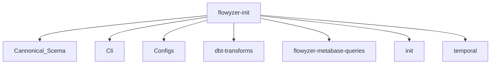
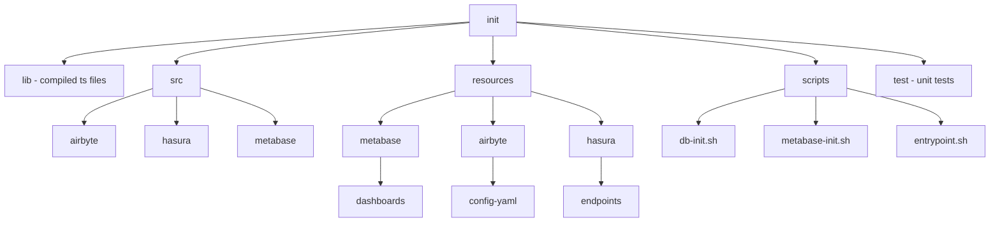
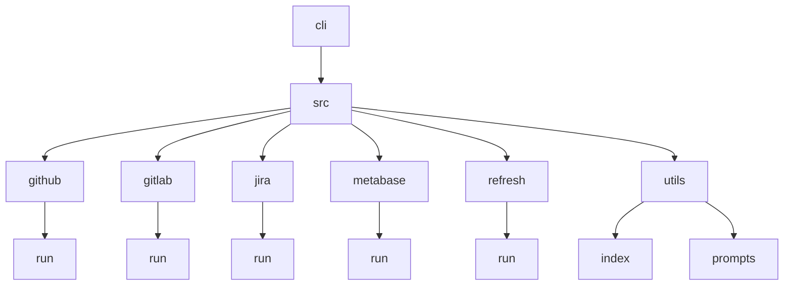

# File & Folder Structure

- flowyzer-init
  - Cannonical_Scema
  - Cli
  - Configs
  - dbt-transforms
  - flowyzer-metabase-queries
  - init
  - temporal

## /init/

- init
  - lib - contains all the compiled output files of the `src` folder's files
  - src
    - airbyte
      - contains all the initialization
      - initialization and setup of the Airbyte workspace
    - hasura
      - set up and manage the Hasura GraphQL engine by interacting with the Hasura API.
    - metabase
      - metabase.ts: Handles authentication and API interactions with Metabase, including dashboard operations.
      - dashboards.ts: Implements operations for managing Metabase dashboards, integrated with metabase.ts for API interactions and logging.
      - init.ts gets triggerd by entrypoint.sh with relevant commands.
  - resources
    - metabase
      - dashboards - all config files for metabase dashboards.
    - hasura - contains the hasura graphql queries and sql queries.
    - airbyte - contains connection config yaml files.
  - scripts - contains all the shell scripts (entypoint.sh, db-init.sh, metabase-init.sh)
  - test - unit tests

## /cli/

The cli directory contains scripts and functionality for integrating with various external services and managing data synchronization processes.

- src

  - cli.ts

  - Github

    - run
      - Repository Selection: Fetches and prompts the user to select repositories if not provided.
      - Airbyte Setup: Configures an Airbyte source with the selected repositories and credentials.

  - Gitlab

    - run
      - Project Selection: Fetches and prompts the user to select projects if not provided.
      - Airbyte Setup: Configures an Airbyte source with the selected projects and credentials.

  - jira

    - run
      - Airbyte Setup: Configures an Airbyte source with the selected projects and credentials.

  - metabase

    - run
      - fromConfig Method: Creates a new Metabase instance based on provided configuration.

  - refresh

    - run.ts
      - The refresh/run.ts file manages the refresh process for various data sources managed by Airbyte.
      - Checks and refreshes GitHub, GitLab, Bitbucket, and Jira connections.

  - utils
    - index
      - contains utility functions
    - prompts
      - contains interfaces and enums

