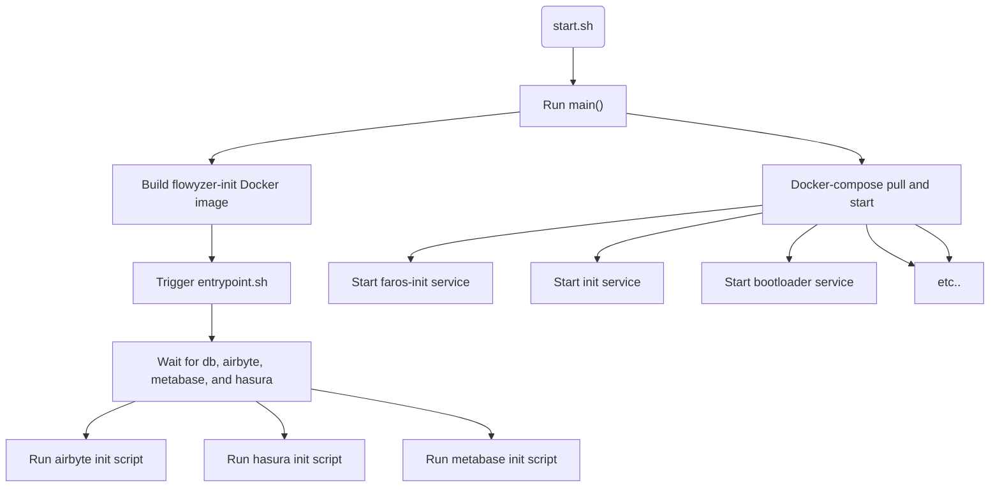

### How Flowyzer starts

- start.sh script runs the main() fn
  - The main function will build the latest version of flowyzer-init docker image
- The dockerfile will use the flyway docker image as the base image
  - Creates a new user flyway.
  - Setup directory structure and copy project files to the directory.
  - Copies the canonical-schema directory and scripts from the init directory into the image.
  - will set the ENTRYPOINT ["./entrypoint.sh"]

### Docker-compose

The start.sh runs the docker-compose. The docker-compose will pull these following images and start the containers.

- Initialization Service (faros-init)
- Init Service (init)
- Bootloader Service (bootloader)
- Database Service (db)
- Worker Service (worker)
- Server Service (server)
- Webapp Service (webapp)
- Airbyte Temporal Service (airbyte-temporal)
- Airbyte Cron Service (airbyte-cron)
- Airbyte API Server Service (airbyte-api-server)
- Airbyte Connector Builder Server Service (airbyte-connector-builder-server)
- Airbyte Proxy Service (airbyte-proxy)
- Hasura Service (hasura)
- Metabase Service (metabase)
- N8N Service (n8n)

### Entrypoint.sh

The Root Dockerfile runs the entrypoint.sh

- Waits until for the database, airbyte, metabase and the hasura containers to be ready.
- Runs the node `../lib/airbyte/init` script for Airbyte, passing in the necessary arguments.
- Runs the `node ../lib/hasura/init` script for Hasura.
- Runs the `./metabase-init.sh` script to initialize Metabase.

### DB-Init.sh

This script is designed to manage the creation of PostgreSQL databases and apply Flyway migrations to one of the databases. Here's a breakdown of what each part of the script does:

- Applying Flyway Migrations: After creating the Faros database, the script applies Flyway migrations to it.
- Creating Additional Databases: The script then creates additional databases (Hasura, Metabase, and n8n) using the create_database function.

### Metabase-init.sh

- This script is designed to configure a Metabase instance with a PostgreSQL database and import dashboards.
- Authenticating with Metabase
- Setting up metabase configuration
- If the user setup is not completed, it sets up Metabase with the provided details and database configuration.
- Importing dashboards it confirms that the Faros database is attached to Metabase and runs `/lib/metabase/init.js` script to import dashboards.

