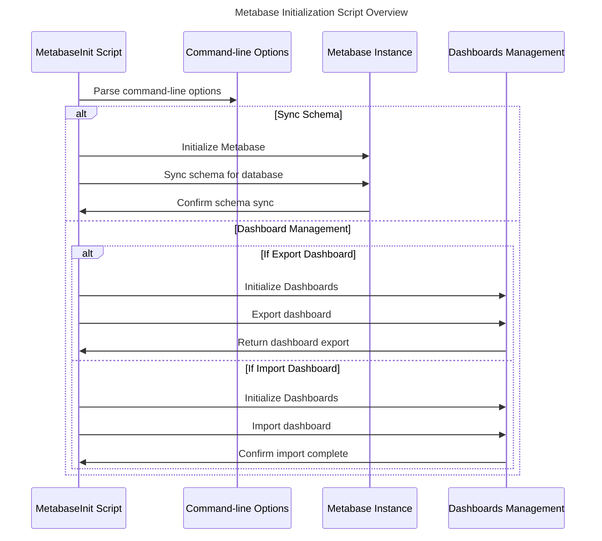

### How Flowyzer starts

- **start.sh script runs the main() fn**

  - The main function builds the latest version of the `flowyzer-init` Docker image.

- **Dockerfile**
  - Uses the flyway Docker image as the base image.
  - Creates a new user `flyway`.
  - Sets up directory structure and copies project files to the directory.
  - Copies the `canonical-schema` directory and scripts from the `init` directory into the image.
  - Sets the ENTRYPOINT to `["./entrypoint.sh"]`.

### Docker-compose

The `start.sh` script runs Docker-compose, which pulls and starts the following images and containers:

- **Initialization Service (faros-init)**
- **Init Service (init)**
- **Bootloader Service (bootloader)**
- **Database Service (db)**
- **Worker Service (worker)**
- **Server Service (server)**
- **Webapp Service (webapp)**
- **Airbyte Temporal Service (airbyte-temporal)**
- **Airbyte Cron Service (airbyte-cron)**
- **Airbyte API Server Service (airbyte-api-server)**
- **Airbyte Connector Builder Server Service (airbyte-connector-builder-server)**
- **Airbyte Proxy Service (airbyte-proxy)**
- **Hasura Service (hasura)**
- **Metabase Service (metabase)**
- **N8N Service (n8n)**

### Entrypoint.sh

The Root Dockerfile runs the `entrypoint.sh`.

- **Waits for Containers**

  - Waits for the database, Airbyte, Metabase, and Hasura containers to be ready.

- **DB Initialization**

  - Runs the `./db-init.sh` script to initialize Database.

- **Airbyte Initialization**

  - Runs the `node ../lib/airbyte/init` script for Airbyte, passing necessary arguments.

- **Hasura Initialization**

  - Runs the `node ../lib/hasura/init` script for Hasura.

- **Metabase Initialization**
  - Runs the `./metabase-init.sh` script to initialize Metabase.

### Sequence Diagram of How flowyzer starts

### DB-Init.sh

This script manages the creation of PostgreSQL databases and applies Flyway migrations.

- **Applying Flyway Migrations:**

  - After creating the Faros database, the script applies Flyway migrations to it.

- **Creating Additional Databases:**
  - Uses the `create_database` function to create additional databases:
    - Hasura
    - Metabase
    - n8n

### Metabase-init.sh

This script configures a Metabase instance with a PostgreSQL database and imports dashboards.

- **Authenticating with Metabase:**

  - Handles authentication to the Metabase instance.

- **Setting up Metabase Configuration:**

  - Configures Metabase with the provided details and database configuration if the setup is not completed.

- **Importing Dashboards:**
  - Confirms that the Faros database is attached to Metabase.
  - Runs the `/lib/metabase/init.js` script to import dashboards.

### Initialization of Metabase, Hasura and Airbyte

##### airbyte/init.ts

1. **Parse Command-line Options:**

   - The script begins by parsing command-line options provided during execution.

2. **Initialize Logger:**

   - It initializes a logger using Pino, configuring it with custom log levels and setting the log level to `info`.

3. **Check Airbyte Health:**

   - The script uses Axios to make GET requests to the Airbyte `/health` endpoint.
   - It retries this operation up to 30 times with a 1-second timeout between retries.
   - If Airbyte is not deemed healthy (based on the response), an error is thrown indicating Airbyte is not ready.

4. **Send Identity and Start Event (Telemetry):**

   - It constructs a Segment user object (`SegmentUser`) using environment variables.
   - If the user information (`envEmail`) is available, it generates a UUID based on the email address using `uuidv5`.
   - It initializes the Segment analytics client (`Analytics`), identifying the user and sending a 'Start' event.
   - Any errors encountered during this process are logged.

5. **Setup Workspace:**

   - Fetches a list of workspaces from the Airbyte instance.
   - If no default workspace is found or more than one workspace exists, errors are thrown accordingly.
   - Checks if the workspace's initial setup is complete.
   - If setup is not complete (or if forced), it fetches the latest version of a specific Docker image (`FAROS_DEST_REPO`).
   - Uses `AirbyteInitV40` to initialize the Airbyte destination with Hasura, providing the fetched version, Hasura URL, Hasura admin secret, and Segment user ID.
   - Logs the setup progress and any errors encountered during the setup process.

6. **Completion:**
   - Once the workspace setup completes successfully, it logs "Airbyte setup is complete".

This sequence diagram provides a high-level overview of how the `init.ts` script operates, interacting with command-line options, Airbyte instance, Segment for telemetry, and logging status updates throughout its execution.

##### hasura/init.ts

1. **Initialization**:

   - Parses command-line options using `commander`.
   - Initializes logging with `pino`.

2. **Hasura Initialization**:

   - Uses Axios to interact with Hasura API, configured with provided URL and optional admin secret.
   - Tracks all tables and their relationships in the PostgreSQL database connected to Hasura.

3. **List All Tables and Foreign Keys**:

   - Retrieves a list of all tables using a custom SQL query (`list-all-tables.sql`).
   - Retrieves foreign key relationships using another SQL query (`list-all-foreign-keys.sql`).

4. **Metadata and Database Source**:

   - Fetches metadata from Hasura to get information about sources and tables.
   - Ensures that the default source (`'default'`) is connected to the Faros database.

5. **Tracking Tables and Relationships**:

   - If no tables are tracked, loads source metadata into Hasura.
   - Tracks untracked tables by calling `pg_track_table` API endpoint.
   - Creates object and array relationships between tables using `pg_create_object_relationship` and `pg_create_array_relationship` API endpoints.

6. **Query Collections and Endpoints**:

   - Loads query collections from predefined GraphQL files (`endpoints/*.gql`).
   - Updates existing query collections in Hasura metadata.
   - Creates or updates REST endpoints based on the loaded queries.

7. **Logging and Completion**:
   - Logs messages using the initialized logger (`pino`) throughout the process.
   - Upon completion, logs "Hasura setup is complete".

This script ensures that the Hasura instance is configured with the necessary tables, relationships, query collections, and REST endpoints, essential for managing and interacting with the connected PostgreSQL database effectively.

### Metabase Initialization Script Overview

1. **Initialization**:

   - Parses command-line options using `commander`.
   - Initializes logging with `pino`.

2. **Schema Synchronization**:

   - If `--sync-schema` option is provided:
     - Initializes Metabase instance using provided URL, username, and password.
     - Calls `syncSchema` method on the Metabase instance to synchronize the schema for the specified database.
     - Logs "Metabase sync schema triggered" upon completion.

3. **Dashboard Management**:

   - If `--export`, `--import-one`, or `--import-new` options are provided:
     - Initializes Dashboards management using provided Metabase URL, username, password, and database name.
     - Performs actions based on the provided options:
       - **Export Dashboard** (`--export <dashboardId>`):
         - Exports the dashboard identified by `<dashboardId>` using `export` method from `Dashboards` class.
         - Logs the exported dashboard.
       - **Import Dashboard** (`--import-one <filename>`):
         - Imports a dashboard from the specified file using `importOne` method from `Dashboards` class.
         - Logs "Metabase import is complete" upon successful import.
       - **Import New Dashboard** (`--import-new`):
         - Imports a new dashboard using `importNew` method from `Dashboards` class.
         - Logs "Metabase import is complete" upon successful import.

4. **Logging and Error Handling**:
   - Logs messages using the initialized logger (`pino`) throughout the process.
   - Catches and logs any errors that occur during script execution, ensuring the process exits with a non-zero status code upon encountering an error.

This script provides functionality to interact with Metabase, enabling schema synchronization and dashboard management operations such as exporting and importing dashboards. It ensures that the Metabase instance is configured and managed according to the specified command-line options, facilitating automated setup and management tasks effectively.

##### metabase/init.ts

