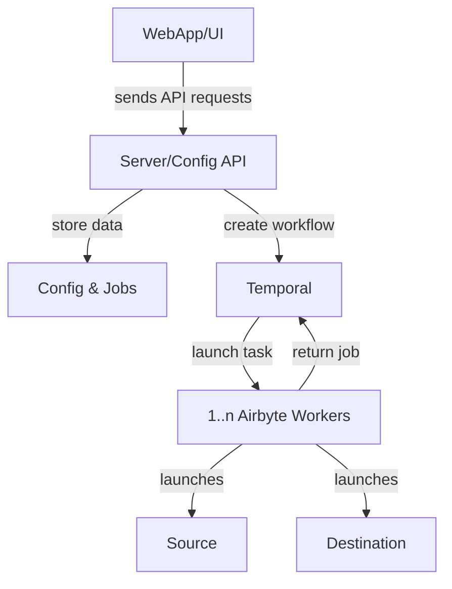

# Airbyte

Airbyte allows you to define ELT connections between sources (extract) and destinations (load). Those are the main menus you see in the Airbyte UI. In this case, sources will be your engineering systems (GitHub, Jira, Jenkins, etc.), and the destination will be Faros CE.

### Things to note: Airbyte

- Airbyte only communicates with the Hasura endpoints.
- Airbyte is not aware of Postgres.
- You can also use an existing copy of Airbyte if you want; just configure the sources and destinations.

### Sources

Source connectors are the pieces of code that extract data from those systems. They are either part of the Airbyte-maintained catalog or built by Faros.

Source settings are where most of your input is needed as they usually include:

- An API token field
- A domain field (e.g., your Jira domain name)
- A field containing the list of "streams" (projects, repositories, pipelines, etc.) you want to get synced in Faros CE
- A start date field controlling how far back to sync data

### The Faros Destination

The Faros Destination connector is where Faros takes all the streams of the various sources we want to support and maps them to our tables you can see in Metabase.

### Connections between Sources and the Faros Destination

You created an Airbyte connection when you link a source and a destination together; that connection also has a few settings:

- The frequency of the sync
- The data streams (e.g., for GitHub - Users, Pull Requests, Commits, etc.) and their sync mode
- The table prefix, which allows for namespacing before it is handed over to the destination

## Architecture overview

- **Web App/UI [airbyte-webapp, airbyte-proxy]:** An easy-to-use graphical interface for interacting with the Airbyte API.
- **Server/Config API [airbyte-server, airbyte-server-api]:** Handles connection between UI and API. Airbyte's main control plane. All operations in Airbyte such as creating sources, destinations, connections, managing configurations, etc.. are configured and invoked from the API.
- **Database Config & Jobs [airbyte-db]:** Stores all the connections information (credentials, frequency...).
- **Temporal Service [airbyte-temporal]:** Manages the task queue and workflows.
- **Worker [airbyte-worker]:** The worker connects to a source connector, pulls the data and writes it to a destination.

##### The diagram shows the steady-state operation of Airbyte, there are components not described you'll see in your deployment:

- **Cron [airbyte-cron]:** Clean the server and sync logs (when using local logs)
- **Bootloader [airbyte-bootloader]:** Upgrade and Migrate the Database tables and confirm the enviroment is ready to work.
